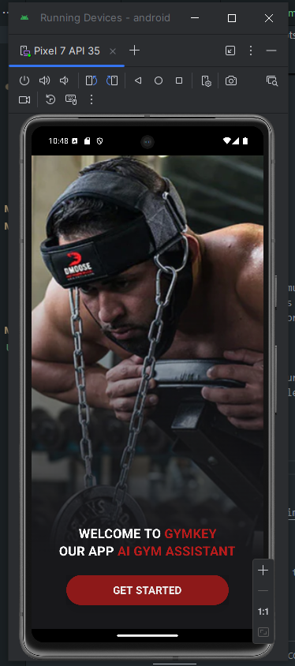

# Gymm App

Gymm App is a React Native application designed to be your AI Gym Assistant. It helps you manage your workouts, track your progress, and stay motivated.

## Features

- AI-powered gym assistant
- User-friendly interface
- Responsive design
- Animated transitions
- Easy navigation

## Installation

1. Clone the repository:
   ```bash
   git clone https://github.com/AlanMelendez/gymApp-react-native
   ```
2. Navigate to the project directory:
   ```bash
   cd gymm-app
   ```
3. Install dependencies:

   ```bash
   npm install
   ```

   or if you prefer use bun (it's better than npm 😁) run the command below.

   ```bash
   bun i
   ```

4. Run the application:
   ```bash
   npm start
   ```  
   ```bash
   bun run <android|web|ios>
   ```

## Usage

- Open the app on your device or emulator.
- Follow the on-screen instructions to get started.
- Navigate through the app to explore its features.

## Screenshots

The login page allows users to securely sign in to their accounts. It features a clean and simple design with the following elements:

- Login button



## Contributing

If you would like to contribute to the project, please fork the repository and submit a pull request.

## License

This project is licensed under the MIT License. See the [LICENSE](LICENSE) file for more details.
